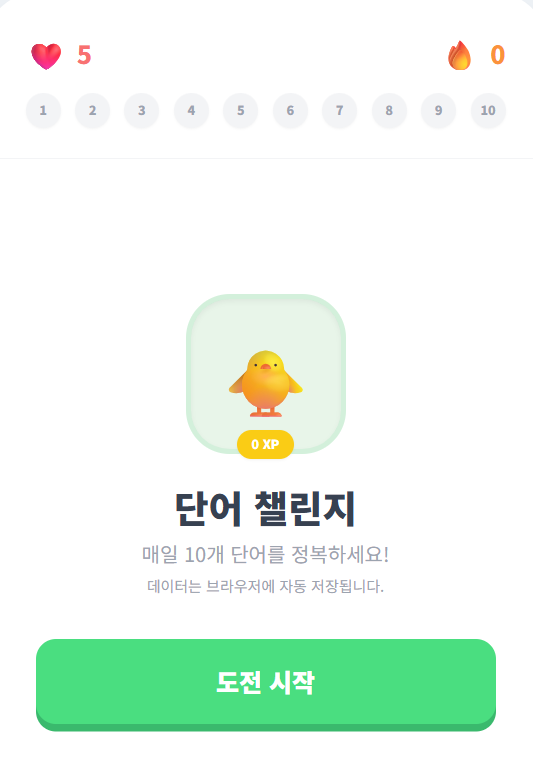
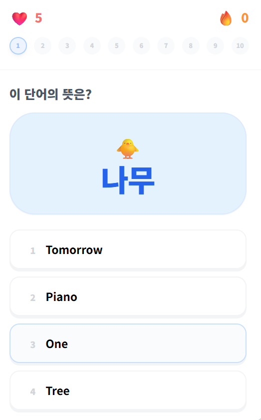
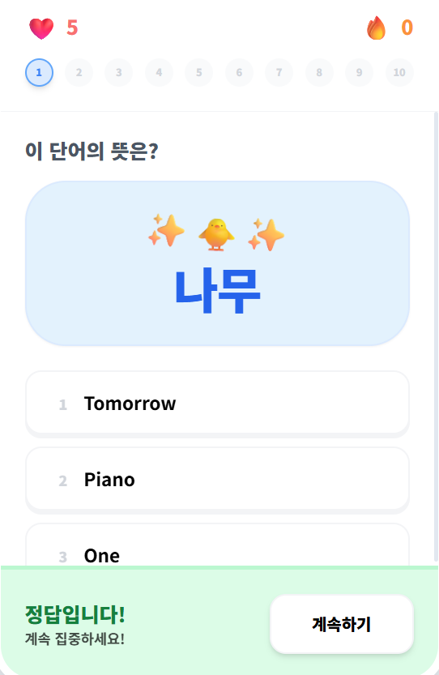

# 단어 챌린지

듀오링고 스타일의 한국어 → 영어 단어 학습 퀴즈 앱입니다.

## URL

## 화면 미리보기

| 메인 화면 | 퀴즈 화면 | 정답 확인 |
|:---------:|:---------:|:---------:|
|  |  |  |

## 기능

- **4지선다 퀴즈** — 랜덤으로 선택된 10개 단어를 맞추는 방식
- **발음 듣기 (TTS)** — 단어 카드의 🔊 버튼으로 한국어 발음, 정답 확인 시 영어 발음 자동 재생
- **하트 시스템** — 5개 하트, 오답 시 1개 차감
- **스트릭 & XP** — 연속 정답 시 보너스 XP 획득
- **자동 저장** — 브라우저 localStorage에 XP·스트릭 저장

## 단어 데이터

`words.js`에 100개 한/영 단어 쌍이 담겨 있습니다.
단어를 추가·수정하려면 이 파일만 편집하면 됩니다.

```js
{ korean: "나무", english: "Tree" },
{ korean: "사과", english: "Apple" },
// ...
```

## 파일 구조

```
english_quiz/
├── index.html   # HTML 구조
├── style.css    # 스타일
├── words.js     # 단어 데이터
└── app.js       # 게임 로직 + TTS
```

## 실행 방법

`file://` 프로토콜로 직접 열면 JS 파일 로드 오류가 발생할 수 있습니다.
아래 방법 중 하나를 사용하세요.

**VS Code Live Server**
1. VS Code에서 `index.html` 열기
2. 우하단 `Go Live` 클릭

**Python 내장 서버**
```bash
python -m http.server 8000
# 브라우저에서 http://localhost:8000 접속
```

## 브라우저 지원

TTS 기능은 Chrome / Edge에서 가장 안정적으로 동작합니다.
